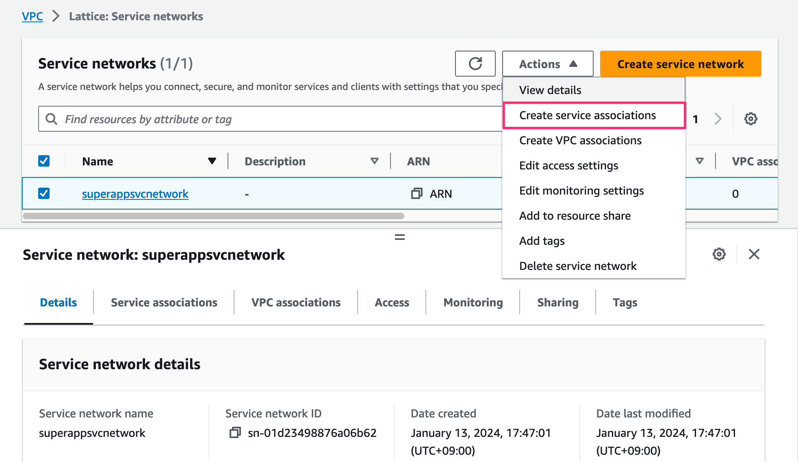

# 2. Service 생성

VPC Lattice 를 구성하기 위한, "Step 2. VPC Lattice Service 구성"을 수행합니다.

<figure><figcaption></figcaption></figure>

## 1.Parking Service 생성

Parking Service는 EC2를 통해서 서비스를 제공하는 "Rate" 와 ALB를 통해서 서비스를 제공하는 "Payments" 로 구성됩니다.

### Step1. Create a VPC Lattice service

"VPC Lattice" - "Lattice Service"를 선택하고 , "Create Service"를 선택합니다.

<figure><figcaption></figcaption></figure>

먼저 Service Name을 구성합니다. 식별이 용이하게 하기 위해서 Serivce Name은 "Parking"으로 구성합니다.

Parking Service에는 앞서 구성한 2개의 Target Group이 포함됩니다. (rate-tg, payment-tg)

<figure><figcaption></figcaption></figure>

Auth type은 뒤에서 구성할 것이므로, "None"을 선택합니다.

<figure><figcaption></figcaption></figure>

* Service Name : parking
* Auth type : None

### Step2. Define Routing

이제 2개의 Target Group에 대한 Routing 구성을 위해 "Listner"와 "Listener Rule"을 구성합니다.

아래에서 처럼 "Add Listener"를 선택합니다.

<figure><figcaption></figcaption></figure>

* Add listener 선택

"Listener Name"-"Use the Protocol and port as the listener name" 을 선택합니다.

"Protocol:Port"-"HTTP:80"을 선택합니다.

Default Action은 "rate-tg" 또는 "payments-tg"를 선택합니다.

<figure><figcaption></figcaption></figure>

* Listener name - Use the protocol and port as the listener name
* Protocol Port : HTTP/80
* Default Action : rates-tg 또는 payments-tg

"Listener rules" 에 "Add rule"을 선택해서 "Listener Rules"를 추가 구성합니다.

<figure><figcaption></figcaption></figure>

* Listener rules 옵션 선택 - Add rule 선택

아래 그림과 같이 2개의 Rule (rates-rule, payments-rule)을 구성합니다.

<figure><figcaption></figcaption></figure>

Rule: rates-rule

* Rule name : rates-rule
* Priority : 10
* Condition : /rates
* Action : rates-tg

Rule: payments-rule

* Rule name : payments-rule
* Priority : 20
* Condition: /payments
* Action : payments-gt

위의 값을 모두 설정하고, Next를 선택합니다.

### Setp3. Create network associations

"Network Association" 은 다음에서 챕터에서 수행하므로 생략하고, "Next"를 선택하고 완료합니다.

<figure><figcaption></figcaption></figure>

* VPC Lattice service networks - 별도의 값을 입력하지 않습니다.

Next를 선택합니다.

### Step4.Review and create

이제 VPC Lattice Service가 설정된 값을 확인하고, "Create VPC Lattice service"를 선택합니다.

아래와 같이 Service 가 생성되었습니다.

<figure><figcaption></figcaption></figure>

## 2.Reservation Service 생성

Reservation Service는 Lambda를 통해서 서비스를 제공됩니다.

### Step1. Create a VPC Lattice service

"VPC Lattice" - "Lattice Service"를 선택하고, "Create Service"를 선택합니다.

<figure><figcaption></figcaption></figure>

먼저 Service Name을 구성합니다. 식별이 용이하게 하기 위해서 Service Name은 "reservation"으로 구성합니다.

Reservation Service에는 앞서 구성한 1개의 Target Group이 포함됩니다. (reservation-tg)

* Service Name : reservation
* Auth type : None

### Step2. Define routing

이제 1개의 Target Group에 대한 Routing 구성을 위해 "Listener"와 "Listener Rule"을 구성합니다.

아래에서 처럼 "Add Listener"를 선택합니다.

<figure><figcaption></figcaption></figure>

* Add listener 선택

"Listener Name"-"Use the Protocol and port as the listener name" 을 선택합니다.

"Protocol:Port"-"HTTPS:443"을 선택합니다.

Default Action은 "reservation-tg"를 선택합니다.

<figure><figcaption></figcaption></figure>

* Listener name - Use the protocol and port as the listener name
* Protocol Port : HTTPS/443
* Default Action : reservation-tg

위의 값을 모두 설정하고, Next를 선택합니다.


Target Group이 1개 이므로 add listener rules 구성은 요구하지 않습니다.


### Step3. Create network associations

"Network Association"은 다음 챕터에서 수행하므로 생략하고, "Next"를 선택하고 완료합니다.

<figure><figcaption></figcaption></figure>

* VPC Lattice service networks - 별도의 값을 입력하지 않습니다.

Next를 선택합니다.

### Step4.Review and create

이제 VPC Latitce Service가 설정된 값을 확인하고, "Create VPC Lattice service"를 선택합니다.

아래와 같이 Service 가 생성되었습니다.

<figure><figcaption></figcaption></figure>

### Step5. 구성확인

"reservation", "parking" service가 모두 생성이 완료되면, "VPC Lattice" - "Serivces" 에서 아래와 같이 "Service" 구성을 확인할 수 있습니다.

<figure><figcaption></figcaption></figure>
